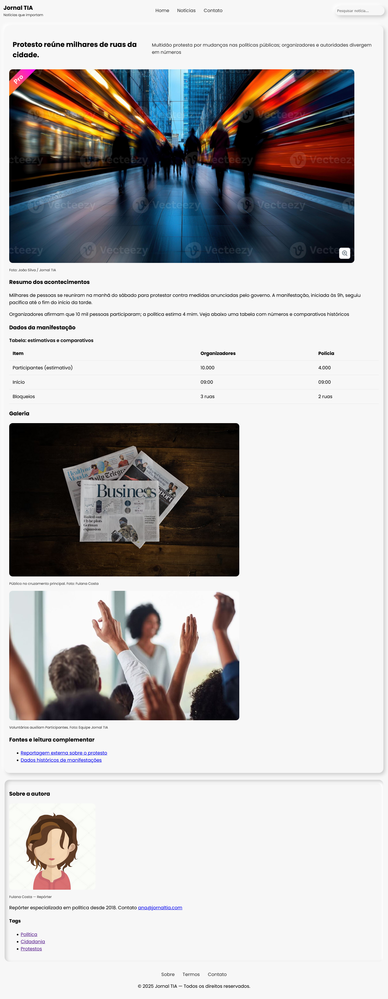

# Projeto: Página de Notícia — Jornal TIA 📰

Uma página web semântica e acessível que simula a cobertura de um protesto.  
O projeto aplica boas práticas de **HTML5 semântico, acessibilidade (ARIA + visually hidden), responsividade e design tokens em CSS**.

---

## ✨ Funcionalidades

- Estrutura semântica com `header`, `main`, `article`, `aside` e `footer`.
- SEO otimizado com `<title>` e `<meta description>`.
- Navegação acessível:
  - `role="banner"`, `role="navigation"`, `role="search"`, `role="contentinfo"`.
  - Labels ocultos com `.visually-hidden`.
  - Uso de `aria-labelledby` e `aria-label`.
- Inclusão de imagens com descrições (`alt`) e créditos (`figcaption`).
- Tabela de dados com `<caption>`, `<thead>`, `<tbody>`.
- Layout com **CSS Grid e Neumorphism leve**.
- Design tokens para cores, espaçamentos e tipografia.

---

## 📂 Estrutura

📁 projeto/
├── index.html # Página principal
├── css/
│ └── style.css # Estilos globais
└── assets/
└── img/ # Imagens utilizadas

---

## 🖼️ Tecnologias

- **HTML5 semântico**
- **CSS3** (variáveis, grid, responsividade, sombras)
- **Google Fonts (Poppins)**

---

## ⚙️ Melhorias aplicadas na versão final

- Corrigido link do Google Fonts (sem quebra de linha).
- Corrigido seletor do input: `form input[type="search"]`.
- Ajustados IDs inconsistentes (`sec-imagens`).
- Corrigida estrutura da `<table>` com `<thead><tr><th>...`.
- Corrigida extensão da imagem `img3.png`.
- Corrigido `box-shadow` do formulário (remoção de vírgulas extras).
- Manutenção do padrão de espaçamento usando variáveis CSS.
- Pronto para receber responsividade (grid de 2 colunas em telas médias+).

---

## 📝 Licença

Este projeto é de uso educacional.  
&copy; 2025 Jornal TIA — Todos os direitos reservados.
